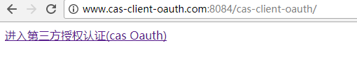
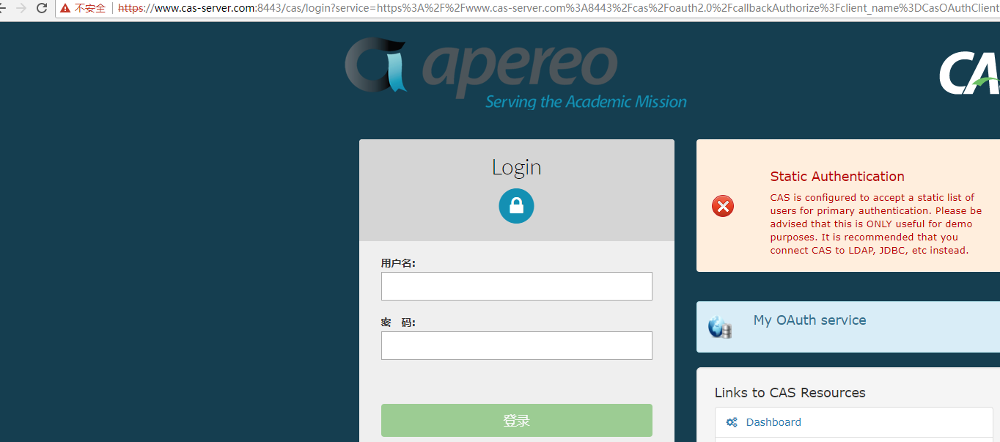
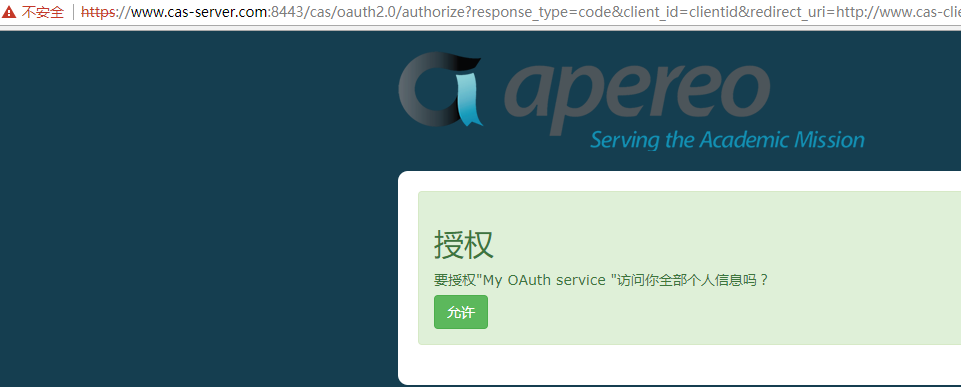
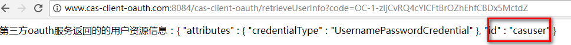

# cas oauth客户端

- 此项目代码参考https://github.com/AMilkTea/OauthClient.git项目；内容参考http://www.lvyonghui.com/2017/09/18/sso4/
- 此项目作为cas oauth客户端，依赖于cas服务端，并且cas服务端支持了oauth协议。测试使用的cas版本为5.1.2

### cas oauth访问逻辑

　　对于CAS服务器来讲，如果作为Oauth授权服务器来使用，[官方文档](https://apereo.github.io/cas/5.1.x/installation/OAuth-OpenId-Authentication.html )有较为详细的说明。  
　　大概意思是CAS通过添加’cas-server-support-oauth-webflow’模块，搭建为Oauth授权服务器后，可以提供三个端点来访问：  

　　１. 通过GET请求’/cas/oauth2.0/authorize’端点可以获取code。请求时需携带参数response_type=code&client_id=ID&redirect_uri=CALLBACK，其中cient_id为在CAS服务器端注册的服务的clientId,即第二步json文件中clientId的值。redirect_uri为CAS返回code时访问的URL  
　　2. 通过POST请求’/cas/oauth2.0/accessToken’可获取token。post请求的参数为grant_type=authorization_code&client_id=ID&client_secret=SECRET&code=CODE&redirect_uri=CALLBACK。其中，client_id与上一步相同，client_secret为json文件中clientSecret的值，code为上一步中获取的code的值。redirect_uri可以跟上一步的redirect_uri保持一致。  
　　3. 通过GET请求’/cas/oauth2.0/profile’端点可获取用户登录信息，例如用户名等，请求时需要携带参数access_token，即上一步中获取的token值。获取到用户名等信息，就表明第三方网站获取到了用户的登录信息。

　　对应上面步骤，访问此项目，下面的域名地址根据实际情况修改
　　1访问http://www.cas-client-oauth.com:8084/cas-client-oauth/

 

　　2点击"进入第三方授权认证(cas Oauth)"，客户端会请求/cas/oauth2.0/authorize端点，由于没有还没有通过cas认证，所以cas服务器会重定向到登录界面。

 

　　3 输入casuser/Mellon

 

　　4 即上面的第一步。点击允许，效果如下图所示：

 

　　5 点击允许后，CAS服务器会重定向请求到上面的redirect_uri的地址，即http://www.cas-client-oauth.com:8084/cas-client-oauth/retrieveUserInfo，Oauth客户端通过RetrieveResourceServlet来处理这个请求。这个请求首先是通过post请求访问了’/cas/oauth2.0/accessToken’端点，获取access_token后，接着又通过GET请求访问了’/cas/oauth2.0/profile’端点，获取到用户信息，并展现到了页面。目前就id属性。更多属性可以扩展、自定义。

